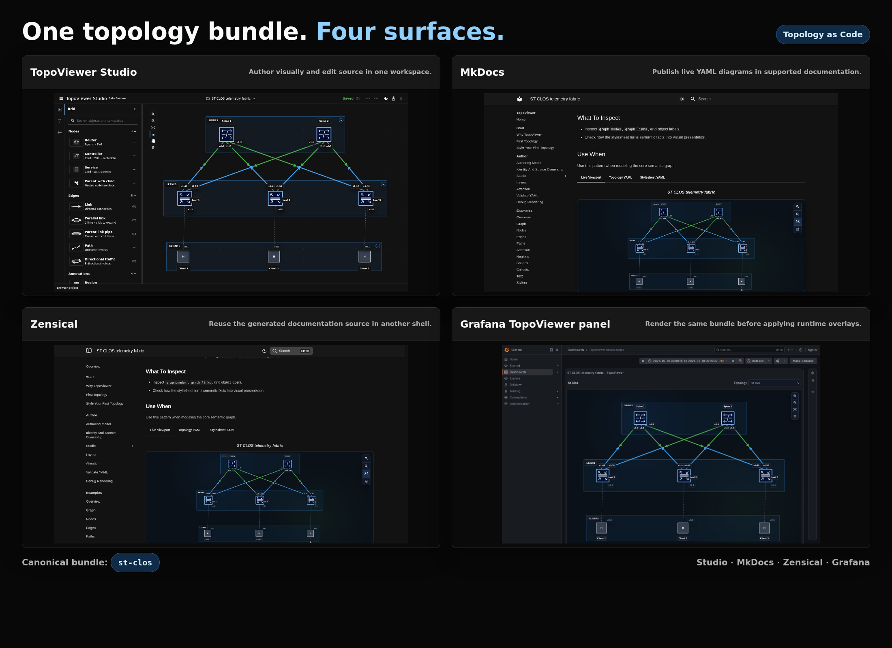
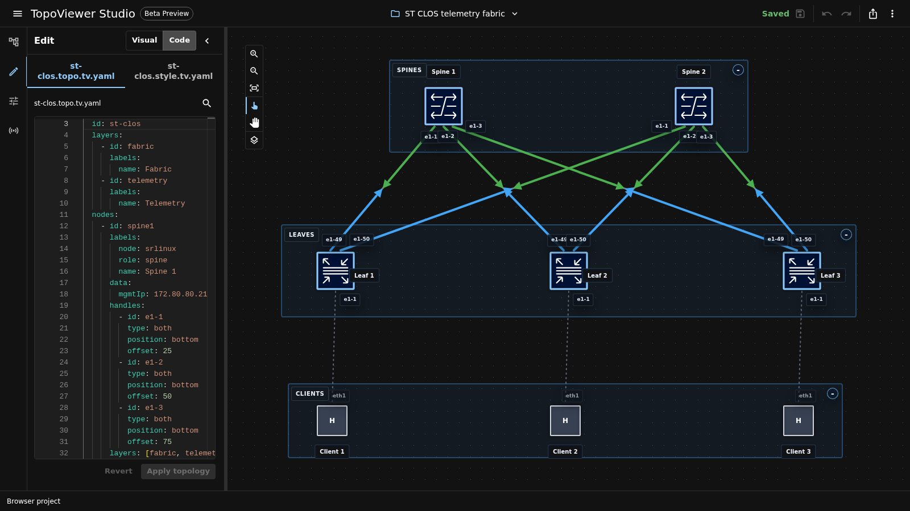

<!-- Generated from packages/topoviewer/content/pages/_fragments/readme.md. Do not edit this file directly. -->
# TopoViewer

[](https://github.com/asadarafat/topoviewer/actions/workflows/ci.yml)
[](https://asadarafat.github.io/topoviewer/docs/zensical/)
[](https://www.npmjs.com/package/topoviewer)
[](https://deepwiki.com/asadarafat/topoviewer)

**Topology as Code for infrastructure, network, and service diagrams.**

TopoViewer transforms declarative YAML models into interactive,
schema-validated topology diagrams. It keeps topology as version-controlled
code instead of static screenshots, so diagrams can be reviewed, tested,
reused, embedded, and eventually connected to runtime state.



## The Idea

Most infrastructure diagrams start useful and then rot. A network changes, a
service moves, a label drifts, a dashboard grows, and the diagram becomes a
historical picture.

TopoViewer treats topology as a semantic asset:

| File | Responsibility |
|---|---|
| `topology.yaml` | The graph facts: nodes, links, paths, regions, layers, labels, data, and state. |
| `stylesheet.yaml` | The presentation policy: icons, labels, colors, layout, emphasis, and interaction states. |
| `mapper.yaml` | Optional runtime binding from telemetry samples to topology objects. |

The result is a clean split:

```text
topology.yaml     stable object identity and relationships
stylesheet.yaml   reusable visual policy
mapper.yaml       optional runtime binding
```

One source can then render across documentation, React applications, authoring
tools, and operational dashboards.

## Why TopoViewer Exists

Generic drawing tools are excellent for sketches. TopoViewer is for diagrams
that need to behave more like infrastructure code.

Use TopoViewer when a topology should be:

- **reviewable** as YAML in pull requests
- **testable** through schemas, semantic validation, and fixtures
- **reusable** across docs, product UIs, and dashboards
- **layered** so one model can produce physical, logical, service, or transport views
- **semantic** so nodes, links, paths, regions, labels, and state remain meaningful
- **operational** when runtime telemetry should land on known topology objects

TopoViewer is not trying to replace every diagramming tool. Mermaid,
Excalidraw, diagrams.net, React Flow, Cytoscape, D3, Grafana, NetBox, Infrahub,
Containerlab, and inventory APIs are still useful. TopoViewer sits in the gap
between those worlds: it gives topology diagrams a stable semantic model and a
renderer that can travel across surfaces.

## Topology Pipeline At A Glance

TopoViewer keeps source data, visual policy, and rendered output separate.

```text
source-of-truth data or hand-authored YAML
        |
        v
topology.yaml + stylesheet.yaml + optional mapper.yaml
        |
        v
TopoViewer renderer
        |
        v
MkDocs · Zensical · Browser Harness · React · Grafana
```



The core package owns the topology model, stylesheet resolution, validation,
layout, and React rendering. Documentation, authoring, and operational surfaces
reuse that core instead of inventing their own topology semantics.

## Start Fast

### Harness

The Harness is the fastest way to try TopoViewer without wiring it into another
product.

[https://asadarafat.github.io/topoviewer/harness/](https://asadarafat.github.io/topoviewer/harness/)

Use it to edit `topology.yaml`, `stylesheet.yaml`, and `mapper.yaml`; validate
drafts; preview the rendered graph; and export bundles for docs, React, or
Grafana.

### MkDocs

MkDocs is the flagship documentation workflow: render live TopoViewer diagrams
directly inside Markdown.

```bash
pip install mkdocs-topoviewer
```

```yaml
# mkdocs.yml
plugins:
  - search
  - topoviewer
```

````markdown
```topoviewer
topology: examples/graph/basic/topology.yaml
stylesheet: examples/graph/basic/stylesheet.yaml
height: 420px
controls: true
title: Graph basic
```
````

Published docs:

[https://asadarafat.github.io/topoviewer/docs/mkdocs/topoviewer/](https://asadarafat.github.io/topoviewer/docs/mkdocs/topoviewer/)

### Zensical Static Docs

TopoViewer also publishes a Zensical static-docs view from the same authored
documentation source:

[https://asadarafat.github.io/topoviewer/docs/zensical/](https://asadarafat.github.io/topoviewer/docs/zensical/)

This is an adapter surface for the published docs, not a separate installable
plugin. Its purpose is to prove that TopoViewer bundles can travel across docs
surfaces without rewriting the topology.

### React

Use the React package when TopoViewer belongs inside a product surface: an
internal portal, topology explorer, incident console, or customer-facing app.

```bash
npm install topoviewer @xyflow/react react react-dom
```

```tsx
import { TopoViewer, type TopoDocument } from 'topoviewer';
import 'topoviewer/style.css';

export function Diagram({ document }: { document: TopoDocument }) {
  return (
    <TopoViewer
      document={document}
      selectedLayerIds={['physical']}
      style={{ height: 420 }}
    />
  );
}
```

### Grafana Panel

TopoViewer can also render operational topology in Grafana. The topology and
style stay declarative; telemetry changes are applied as runtime overlays.

```text
stable topology model
  + Grafana data frames
  + telemetry mapper
  = runtime topology overlay
```

Try the Containerlab-backed Grafana panel demo on a disposable Linux lab
machine:

```bash
curl -fsSL https://raw.githubusercontent.com/asadarafat/topoviewer/development/scripts/bootstrap-grafana-containerlab-lab.sh | bash
```

Containerlab is demo plumbing. TopoViewer itself does not require Containerlab.

## Minimal Model

`topology.yaml` defines the topology facts:

```yaml
graph:
  layers:
    - id: physical
      name: Physical

  nodes:
    - id: PE1
      name: PE1
      labels:
        role: pe
      layers: [physical]
      position: [160, 160]

    - id: P1
      name: P1
      labels:
        role: p
      layers: [physical]
      position: [420, 160]

  links:
    - id: PE1-P1
      source: PE1
      target: P1
      layers: [physical]
```

`stylesheet.yaml` defines how those facts should look:

```yaml
stylesheet:
  - selector: node
    style:
      shape: rectangle
      width: 84
      height: 60
      borderWidth: 3

  - selector: 'node[labels.role = "pe"]'
    style:
      backgroundColor: "#1565c0"
      color: "#ffffff"

  - selector: link
    style:
      curveStyle: straight
      lineColor: "#42a5f5"
      lineWidth: 3
```

The contract is intentionally simple:

```text
model + style = diagram
model + style + mapper = operational topology view
```

## Core Semantics

TopoViewer uses semantic topology objects instead of anonymous drawing shapes.

```text
node       identity, labels, data, state, position, and visual policy
link       endpoints, directionality, labels, data, style, and parallel lanes
path       ordered traversal through the graph
region     logical grouping without manual drawing
layer      filtered views from the same model
mapper     runtime telemetry binding to known topology objects
```

That semantic layer is what lets the same topology render in docs, product UIs,
authoring tools, and operational dashboards.

## Where It Fits

TopoViewer is useful when the diagram is no longer just a picture.

| Need | TopoViewer gives you |
|---|---|
| Keep diagrams in Git | Declarative YAML with stable IDs and reusable style policy |
| Review topology changes | Diffs against model, style, and mapper files |
| Avoid duplicated drawings | Layers, selectors, regions, and paths from one model |
| Embed in products | React package with exported types and CSS |
| Publish in docs | MkDocs plugin and generated docs surfaces |
| Add runtime state | Mapper-driven overlays for operational dashboards |
| Validate before publish | JSON Schema, semantic linting, and renderer checks |

## Project Status

| Surface | Status | Use today |
|---|---|---|
| React package | Supported | Install `topoviewer` from npm and embed `TopoViewer`. |
| MkDocs plugin | Supported | Install `mkdocs-topoviewer` and render live YAML examples. |
| TopoViewer Studio | Experimental | Run the repository-local browser app to author portable bundles; it is not yet the default public authoring route. |
| Browser Harness | Experimental | Author, validate, preview, and export TopoViewer bundles. |
| Zensical | Adapter | Static generated docs adapter, not an installable plugin. |
| Grafana panel | Experimental | Mounted bundles and mapper-driven runtime overlays, proven through the Containerlab demo path. |
| VS Code extension | Roadmap | Planned packaged authoring surface; no VSIX is published yet. |
| NetBox / Infrahub | Roadmap | Future source-of-truth integration surfaces. |

## Local Development

Prerequisites:

```text
Node.js >=24 <25
Python 3.9+
```

```bash
git clone https://github.com/asadarafat/topoviewer.git
cd topoviewer
npm ci
```

Run the full local gate:

```bash
npm run ci
```

Useful focused checks:

```bash
npm run validate:schemas
npm run validate:semantics
npm run lint
npm run build
npm test
npm run pack:check
```

Preview docs and the Harness locally:

```bash
npm run docs:preview
```

```text
MkDocs:  http://127.0.0.1:8001/topoviewer/docs/mkdocs/
Zensical: http://127.0.0.1:8001/topoviewer/docs/zensical/
Harness: http://127.0.0.1:8001/topoviewer/harness/
```

The Grafana panel demo runs locally through the Containerlab profile:

```bash
npm run grafana:clab:up
```

The Containerlab release bundle uses the same panel, topology bundles, mapper
files, and Grafana provisioning, but packages them for the standalone bootstrap
path:

```bash
npm run grafana:clab:bundle
```

## Quality Bar

The repository is early, but it is built with production-shaped guardrails:

- JSON Schema validation
- semantic topology linting
- renderer limit checks
- hostile-content tests for YAML, Markdown, SVG, mapper, and telemetry inputs
- package and docs artifact inspection
- renderer parity checks across Harness, MkDocs, and Zensical
- Playwright interaction coverage
- dependency advisory and Go vulnerability checks
- public-readiness checks for install paths and generated docs

## Security Model

Treat topology inputs as untrusted unless your host application controls the
source.

Inputs that deserve scrutiny:

- topology YAML
- stylesheet YAML
- mapper YAML
- labels and data
- Markdown
- SVG icons
- image references
- telemetry labels
- mounted bundle files

Expected boundaries:

- labels and Markdown should render as inert content unless a host explicitly opts into trusted HTML
- unsafe SVG and image references should be rejected where supported
- oversized documents and embedded assets should be constrained
- mounted bundles should stay inside configured roots
- TopoViewer is not a sandbox for arbitrary hostile HTML or JavaScript
- host applications remain responsible for authentication, authorization, tenancy, and business policy

## Stability Note

TopoViewer is a serious early project. The core package and MkDocs plugin are
published, while some authoring and operational surfaces are still experimental.
APIs, examples, and lab workflows may change while the project hardens.

The project prioritizes stable install paths, clear examples, validated inputs,
and predictable rendering over adding more surfaces too early.

## License

Apache-2.0. See [LICENSE](LICENSE).

## Legacy History

The historical pre-refresh repository is preserved at
[topoViewer-legacy](https://github.com/asadarafat/topoViewer-legacy).
