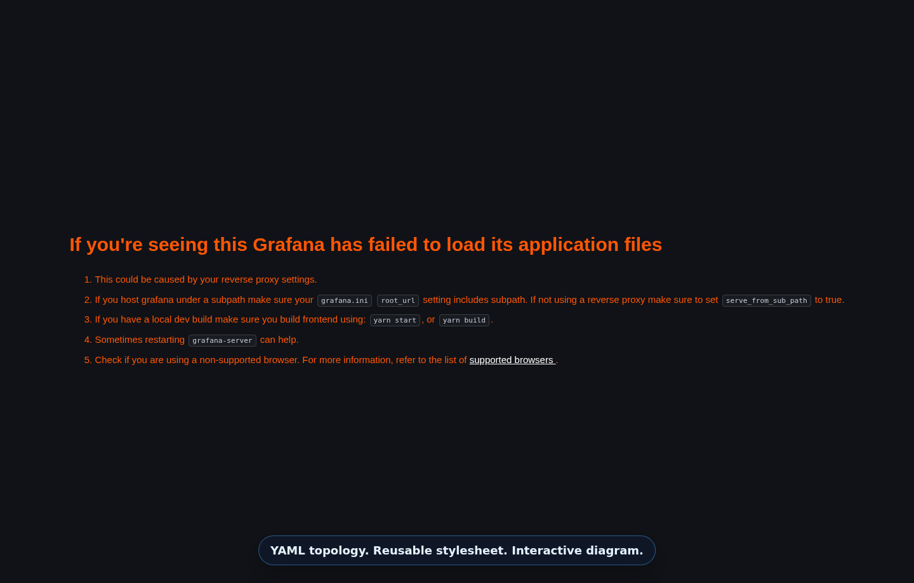

<!-- Generated from packages/topoviewer/content/pages/_fragments/*.md. Do not edit this file directly. -->
# TopoViewer

[](https://github.com/asadarafat/topoviewer/actions/workflows/ci.yml)
[](https://github.com/asadarafat/topoviewer/actions/workflows/docs.yml)

TopoViewer is a **Topology as Code** toolkit for teams that want network,
infrastructure, service, and other connected-system diagrams to stay close to
source data.

Topology here means a diagram or graph made of meaningful objects and
relationships: nodes, links, paths, regions, layers, labels, data, and attention
rules. TopoViewer keeps those facts in declarative YAML and keeps presentation
policy in selector-based stylesheets, then renders both through an embeddable
TypeScript/React runtime.

TopoViewer is not a generic Mermaid.js replacement. Mermaid is broad
text-to-diagram syntax for many diagram families. TopoViewer is narrower and
more semantic: it is built for inspectable, data-driven topology views where
layers, regions, paths, operational metadata, focus behavior, and reusable
runtime APIs matter.

The stable core is deliberately small:

- `topology.yaml` describes objects and relationships.
- `stylesheet.yaml` describes presentation with selectors.
- `TopoViewer` renders an interactive diagram that can be embedded in docs,
  React products, authoring tools, and operational dashboards.

[](https://asadarafat.github.io/topoviewer/harness/)

## Why It Matters

Topology diagrams drift when they are maintained as static images. TopoViewer
keeps topology as reviewable code, so the same model can render documentation,
product views, authoring previews, exported diagrams, and CI-backed examples.

## First Result

```bash
git clone https://github.com/asadarafat/topoviewer.git
cd topoviewer
npm ci
npm run docs:preview
```

Open:

- MkDocs: `http://127.0.0.1:8001/topoviewer/docs/mkdocs/`
- Zensical: `http://127.0.0.1:8001/topoviewer/docs/zensical/`
- Browser Harness: `http://127.0.0.1:8001/topoviewer/harness/`

The smallest useful YAML pair is in the
[First topology guide](https://asadarafat.github.io/topoviewer/docs/mkdocs/topoviewer/getting-started/).

## Integration Surfaces

TopoViewer is designed to be used as a library, a documentation embed, an
authoring surface, and an operational dashboard runtime. The surfaces do not
all have the same maturity.

| Surface | Status | Use today |
|---|---|---|
| TypeScript/React package | Pre-Publish Supported | Embed the renderer from the repo/package build while public npm release gates are completed. |
| MkDocs | Supported | Publish live YAML examples through `mkdocs-topoviewer`. |
| Zensical | Supported Adapter | Preview the same docs content through the generated Zensical site. |
| Browser harness | Experimental | Author, validate, preview, and export TopoViewer YAML. |
| VS Code extension | Experimental | Preview TopoViewer YAML locally; automatic full-project authoring is still evolving. |
| Grafana panel | Experimental | Mount topology/style/mapper bundles and render Prometheus-driven overlays. |
| Grafana Containerlab mode | Lab | Validate realistic telemetry under the Grafana lab; not a separate production surface. |
| NetBox | Roadmap | Future in-product topology visualization from NetBox inventory and platform data. |
| OpsMill/Infrahub | Roadmap | Future in-product topology visualization from Infrahub network topology and inventory data. |

## Support Status Labels

| Status | Meaning |
|---|---|
| Supported | Implemented, documented, CI-gated, and intended for normal use. Compatibility expectations apply. |
| Pre-Publish Supported | Implemented, documented, and CI-gated from source, but public package publication is still pending. |
| Supported Adapter | Implemented, documented, and CI-gated as an adapter path, not as a native upstream plugin package. |
| Experimental | Implemented enough to try, but API, UX, packaging, or operational behavior may still change. |
| Lab | Disposable local validation environment. Do not treat it as production deployment guidance. |
| Roadmap | Planned or under study. Do not depend on it as shipped behavior. |
| Maintainer | Repository maintenance workflow, not an end-user product surface. |

## Quick Links

- [Published MkDocs](https://asadarafat.github.io/topoviewer/docs/mkdocs/)
- [Published Zensical](https://asadarafat.github.io/topoviewer/docs/zensical/)
- [Why TopoViewer](https://asadarafat.github.io/topoviewer/docs/mkdocs/topoviewer/why-topoviewer/)
- [Browser Harness](https://asadarafat.github.io/topoviewer/harness/)
- [Integration Roadmap](https://asadarafat.github.io/topoviewer/docs/mkdocs/topoviewer/integration-roadmap/)

## Development

Prerequisites:

- Node.js 24 LTS
- Python 3.9+ for MkDocs and Zensical workflows

```bash
npm ci
npm run sync:content
npm run ci
```

Content edits start in `packages/topoviewer/content/**`. Generated package
docs/examples, MkDocs pages, Zensical pages, and this README are projections.

## Legacy History

The historical pre-refresh repository is preserved at
[topoViewer-legacy](https://github.com/asadarafat/topoViewer-legacy).
