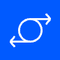
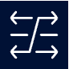
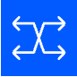
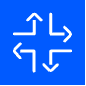
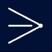
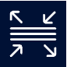
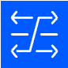
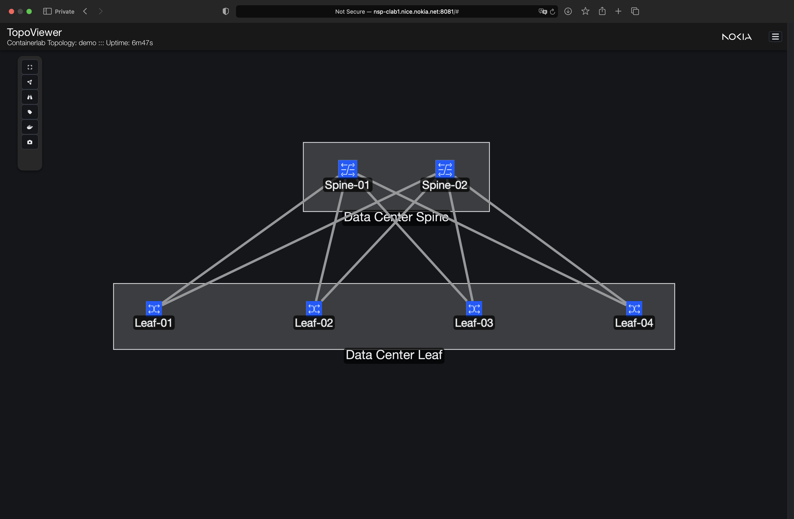

# Enhanced Containerlab Topology Definition
## Containerlab Topology with Icon Customization

TopoViewer enhances visualization by enabling icon customization through `topoViewer-role` labels in the Containerlab topology definition. These labels specify the roles of each node, allowing TopoViewer to assign unique icons for a more intuitive and visually structured topology display.


### Custom Icon Configuration

Each node in the topology is labeled with a `topoViewer-role` to dictate the icon displayed by TopoViewer. The TopoViewer application maps these roles to specific icon URLs.

#### `topoViewer-role` Labels

Define the `topoViewer-role` label in each node to customize its icon:

```yaml
labels:
  topoViewer-role: <role>
```

#### Supported Roles and Icons

Here are the available roles and the corresponding icons they display in TopoViewer:

| Role           | Icon                                                                  |
|----------------|----------------------------------------------------------------------|
| **controller** |  |
| **spine**      |        |
| **leaf**       |        |
| **pe**         |          |
| **pon**        |          |
| **dcgw**       |         |
| **super-spine**|       |

#### Example Usage

Here’s how `topoViewer-role` labels are applied in the topology definition:

```yaml
topology:  
  nodes:
    topoviewer:
      kind: linux
      image: ghcr.io/asadarafat/topoviewer:nightly-24.10.30
      labels:
        topoViewer-role: controller

    Spine-01:
      kind: srl
      image: ghcr.io/nokia/srlinux
      labels:
        topoViewer-role: spine

    Leaf-01:
      kind: srl
      image: ghcr.io/nokia/srlinux
      labels:
        topoViewer-role: leaf
```

By specifying `topoViewer-role` labels for each node, you enable TopoViewer to display nodes with role-specific icons, enhancing the clarity and visual structure of the topology in data center simulations.

---


## Containerlab Topology with Group Organization

TopoViewer supports organizing nodes into hierarchical groups within the topology by using the `group` attribute in the Containerlab configuration. This feature allows you to categorize nodes under specific parent groups, improving the structure and readability of the network layout in TopoViewer.

### Group Configuration

Each node can be assigned a `group` attribute, which TopoViewer interprets as a parent grouping. This grouping adds logical structure to the network by visually clustering nodes that share common roles or functions.

#### Defining a Group

To assign a node to a group, use the `group` attribute in the node configuration:

```yaml
group: "<Group Name>"
```

#### Example Usage

Below is an example of how the `group` attribute can be used to organize nodes in the topology. In this case, spine nodes are grouped under "Data Center Spine" and leaf nodes can be organized under another relevant group, such as "Data Center Leaf."

```yaml
topology:  
  nodes:
    Spine-01:
      kind: srl
      image: ghcr.io/nokia/srlinux
      group: "Data Center Spine"
      labels:
        topoViewer-role: spine

    Spine-02:
      kind: srl
      image: ghcr.io/nokia/srlinux
      group: "Data Center Spine"
      labels:
        topoViewer-role: spine

    Leaf-01:
      kind: srl
      image: ghcr.io/nokia/srlinux
      group: "Data Center Leaf"
      labels:
        topoViewer-role: leaf

    Leaf-02:
      kind: srl
      image: ghcr.io/nokia/srlinux
      group: "Data Center Leaf"
      labels:
        topoViewer-role: leafcontainerlab-topology-definition-group.png
```

#### Group Visualization Example

Below is an example screenshot illustrating how TopoViewer displays nodes grouped under parent categories using the `group` attribute in the Containerlab topology.



In this example:
- Nodes assigned to the **Data Center Spine** group (Spine-01 and Spine-02) are visually clustered together within a labeled boundary.
- Nodes assigned to the **Data Center Leaf** group (Leaf-01 through Leaf-04) are similarly clustered under a separate labeled boundary.

Grouping nodes in this way enhances readability by clearly defining functional areas within the network, making it easier to distinguish between different layers or segments.

#### Benefits of Grouping

By defining groups, you:
- Improve the logical organization of nodes in TopoViewer.
- Create clear, visual distinctions between different layers or roles in your network.
- Enhance readability, particularly in larger or complex topologies.

Grouping can be combined with the `topoViewer-role` labels to provide both role-specific icons and structured node organization, making your topology visually intuitive and easy to navigate.
