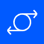
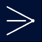
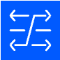

# Containerlab Topology with Icon Customization

TopoViewer enhances visualization by enabling icon customization through `topoViewer-role` labels in the Containerlab topology definition. These labels specify the roles of each node, allowing TopoViewer to assign unique icons for a more intuitive and visually structured topology display.


## Custom Icon Configuration

Each node in the topology is labeled with a `topoViewer-role` to dictate the icon displayed by TopoViewer. The TopoViewer application maps these roles to specific icon URLs.

### `topoViewer-role` Labels

Define the `topoViewer-role` label in each node to customize its icon:

```yaml
labels:
  topoViewer-role: <role>
```

### Supported Roles and Icons

Here are the available roles and the corresponding icons they display in TopoViewer:

| Role           | Icon                                                                  |
|----------------|----------------------------------------------------------------------|
| **controller** |  |
| **spine**      |        |
| **leaf**       |        |
| **pe**         |          |
| **pon**        |          |
| **dcgw**       |         |
| **super-spine**|       |

### Example Usage

Here’s how `topoViewer-role` labels are applied in the topology definition:

```yaml
topology:  
  nodes:
    topoviewer:
      kind: linux
      image: ghcr.io/asadarafat/topoviewer:nightly-24.10.30
      labels:
        topoViewer-role: controller

    Spine-01:
      kind: srl
      image: ghcr.io/nokia/srlinux
      labels:
        topoViewer-role: spine

    Leaf-01:
      kind: srl
      image: ghcr.io/nokia/srlinux
      labels:
        topoViewer-role: leaf
```

By specifying `topoViewer-role` labels for each node, you enable TopoViewer to display nodes with role-specific icons, enhancing the clarity and visual structure of the topology in data center simulations.