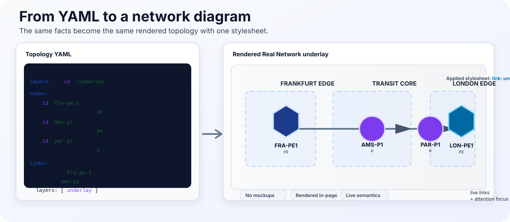

# Why TopoViewer?

TopoViewer turns topology facts into repeatable, inspectable network diagrams. It is built for teams that want diagrams to live close to source data, documentation, and tests instead of being redrawn by hand.



## What Makes It Different

| Need | TopoViewer answer |
| --- | --- |
| Keep diagrams maintainable | Model graph facts in topology YAML and visual policy in a stylesheet. |
| Explain large or dense environments | Use attention queries, aggregation, labels, paths, and regions to show what matters first. |
| Make docs executable | Render the same YAML in MkDocs with live viewports, topology source, and stylesheet source side by side. |
| Embed in products | Use the React/TypeScript package directly, or the browser embed bundle through documentation integrations. |
| Prove behavior | Treat examples as test fixtures with schema validation, semantic linting, and Playwright coverage. |
| Export diagrams | Use renderer exports for documentation, review, and handoff assets. |

## YAML To Diagram

The authored source stays small and reviewable:

```yaml
graph:
  nodes:
    - id: pe-fra-1
      labels: { role: pe, site: fra }
    - id: rr-ams-1
      labels: { role: rr, protocol: bgp }
  links:
    - id: bgp-fra-rr
      source: pe-fra-1
      target: rr-ams-1
      labels: { protocol: bgp }
```

The rendered view is produced by the same example catalog used by the tests:

- [YAML to network diagram](yaml-to-diagram/index.md)
- [Real network demo](real-network-demo.md)

## Built For Network Views

TopoViewer is not a generic chart wrapper. Its model is shaped around topology primitives:

- `graph.nodes` for routers, services, controllers, and endpoints.
- `graph.links` for physical, logical, protocol, or dependency relationships.
- `graph.paths` for service paths, transport paths, and ordered dependencies.
- `graph.regions` for sites, domains, ownership, and failure areas.
- `labels` for classification and selector styling.
- `data` for status, severity, capacity, timestamps, and operational signals.

Those facts can drive multiple views of the same environment: underlay, BGP, service path, and failure impact.
